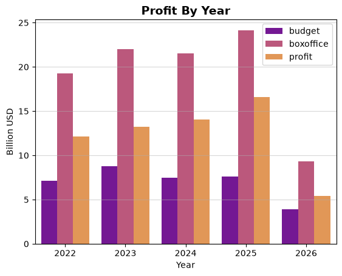
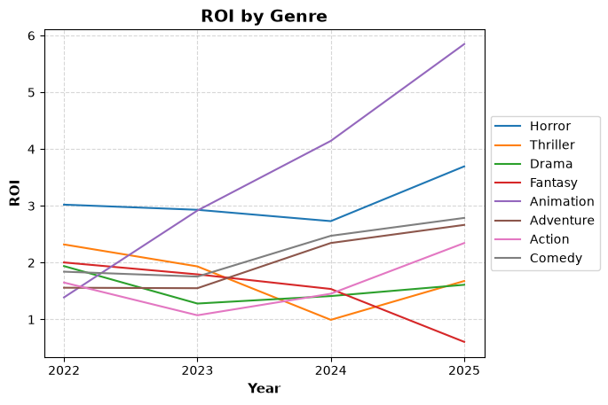

## 🎬 Analysis of post-pandemic cinema

The period of social isolation was crucial in shaping new patterns of behavior in modern society, particularly regarding media consumption. Social media platforms have become a key component of the film industry's new landscape, **it is in digital spaces where trends emerge, marketing strategies are developed, and audience engagement is shaped**.

In this project, I will analysze the **705 most relevant¹ films from 2022 to the present** in order to explore the potential of the contemporary film market. Through this analysis, I aim to **identify emerging sectors and some of these new patterns of consumption**.

The data were collected from IMDb and TMDB. Data from 2026 are included and may be incorporated into the analyses. **However, they should be interpreted with caution, as the year is still ongoing and upcoming releases may influence the reported results**.

¹Based on the highest number of user ratings on IMDb.

---

### 🕵️ Key Research Questions

- Is the film industry still a profitable business?
- Which genres generate the highest profits? Which ones deliver the highest return on investment (ROI)?
- How do audiences respond to different types of films?
- Which films generated the most audience engagement between 2022 and 2025?

### 📁 Project Structure

```
cinemaEDA/
├── data/
│    └── processed/
│    └── raw/
├── database/
│    └── cinema.db
│    └── creatingTables.sql 
│    └── questions.sql 
├── ETL/
│    └── extract_imdb.py
│    └── extract_tmdb.py
│    └── load.py
│    └── transform.py
├── analysis.ipynb
├── README.md
└── requirements.txt
```
### ⚒️ Tools

Technologies used: python, pandas, SQL, SQLite, seaborn, matplotlib, concurrent.features/requests, API, jupyter notebook.

## ⚙️ Pipeline:

### ♻️ ETL

The initial datasets were obtained from IMDb's public datasets (`https://datasets.imdbws.com/`). Specifically, the project uses `title.ratings`, `title.basics`, `title.crew`, and `name.basics`. In `extract_imdb.py`, the `title.ratings` and `title.basics` datasets are merged into `films_imdb.csv`. Some filters are applied to optimize the next extraction.. Next, `extract_tmdb.py` queries the TMDB API for every film contained in the new dataframe to retrieve financial information, such as budget and box office revenue. A `ThreadPoolExecutor` is used to perform concurrent API requests, significantly improving data collection performance.

In `transform.py`, the JSON responses returned by the TMDB API are converted into `financial.csv`, which stores both the financial information and the corresponding IMDb film ID. This allows the financial data to be linked with the remaining datasets during the analysis. The file is then filtered to remove films with incomplete or unreliable financial data, and the remaining records define the set of movies used throughout the project. This filtered dataset also serves as the basis for cleaning the other dataframes, which are then processed and saved to the `data/processed` directory.

The `database/` directory contains the database schema and the SQL queries used throughout the analysis. Finally, `load.py` reads the processed CSV files from `data/processed` and loads them into the database.

### 🔍 Analysis

The project's primary objective is to identify promising investment opportunities within the film industry. By analyzing the collected data, it was possible to calculate the Return on Investment (ROI) for each genre, revealing how different genres perform in terms of generating returns relative to their production costs.



In addition, the project provides a broader view of the film industry. These reveal a steady increase in overall profits over the analyzed period, while production budgets appear to have stabilized.



These and many other insights are explored in greater depth in the `analysis.ipynb` notebook.

### 🚀 How to run:

Python 3.13.3

1. Clone the repository:

```bash 
git clone https://github.com/julhooo/cinema-exploratory-analysis.git
```

2. Install the dependencies:
```bash 
pip install -r requirements.txt
```

3. Run the notebook:
```bash
jupyter-notebook analysis.ipynb
```


